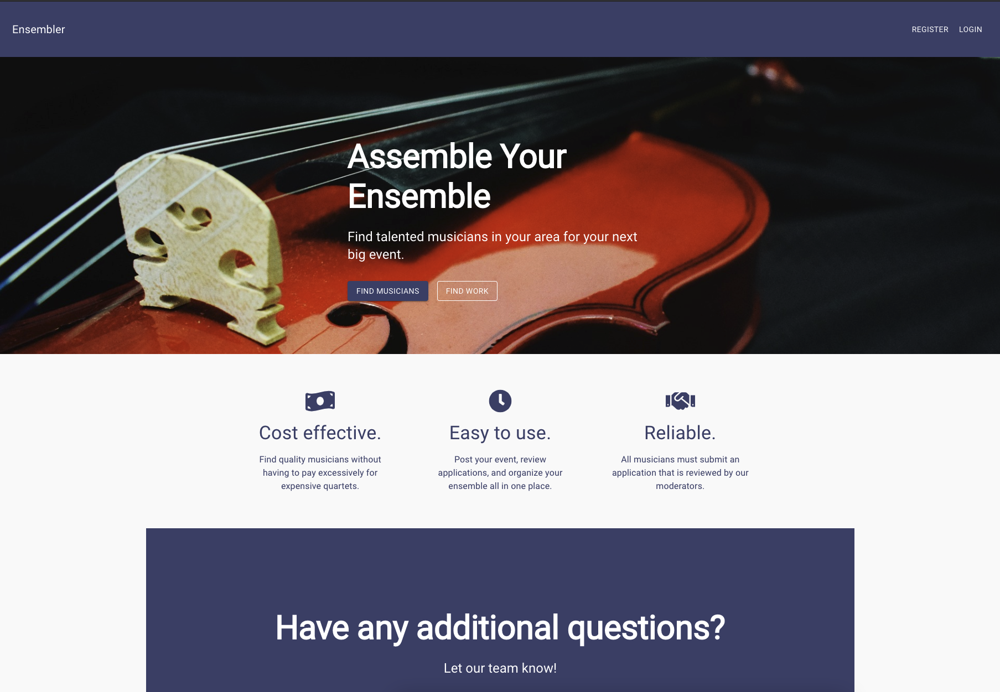
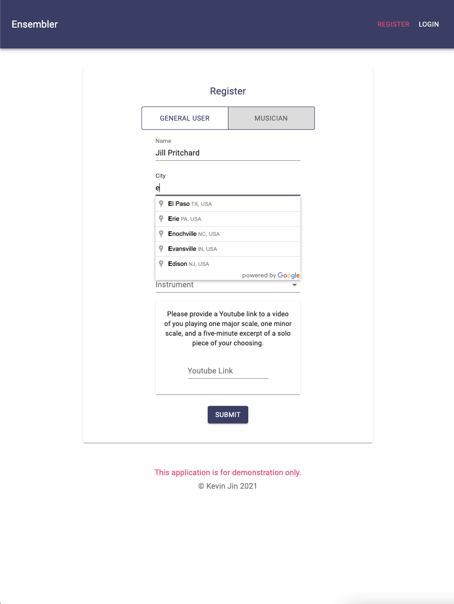
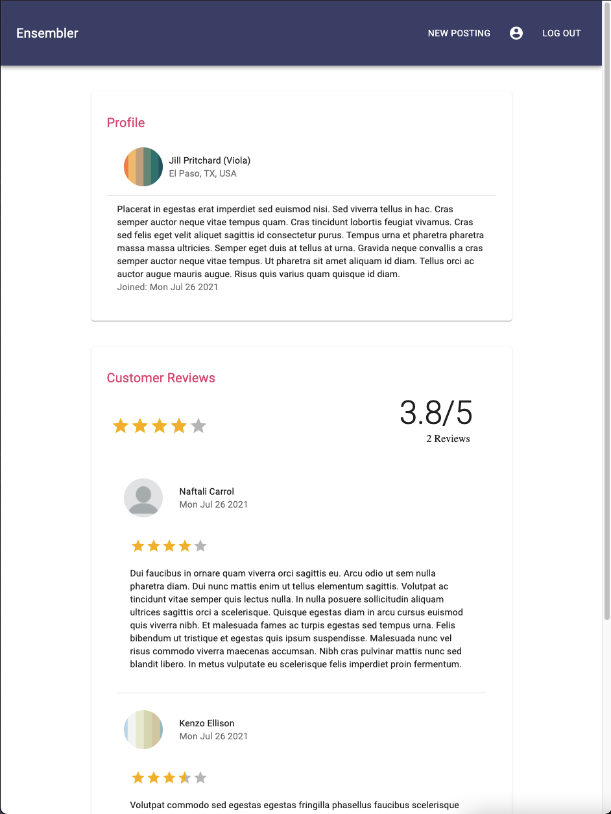
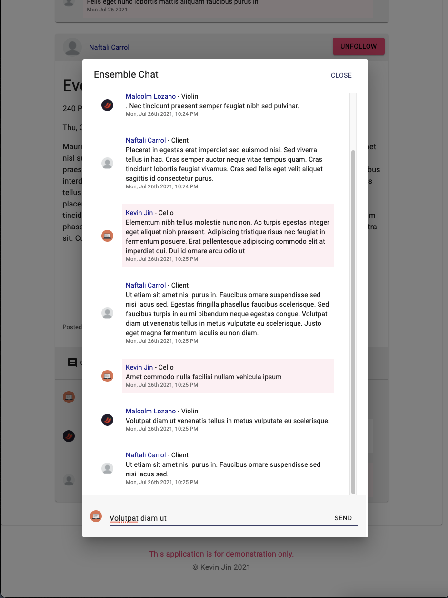
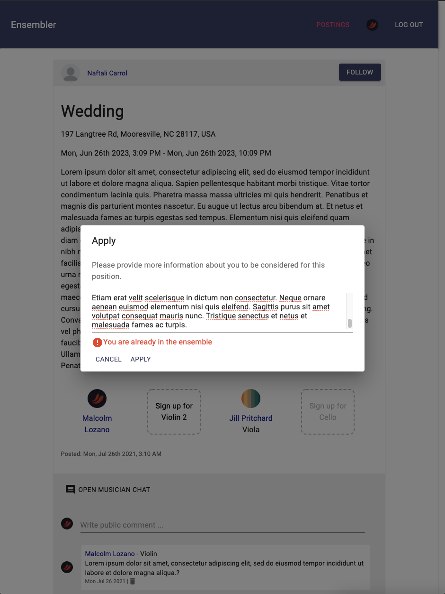
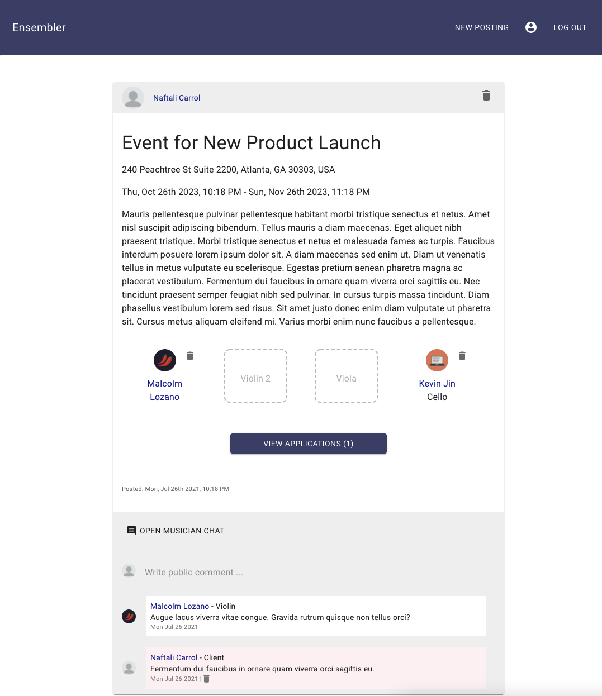
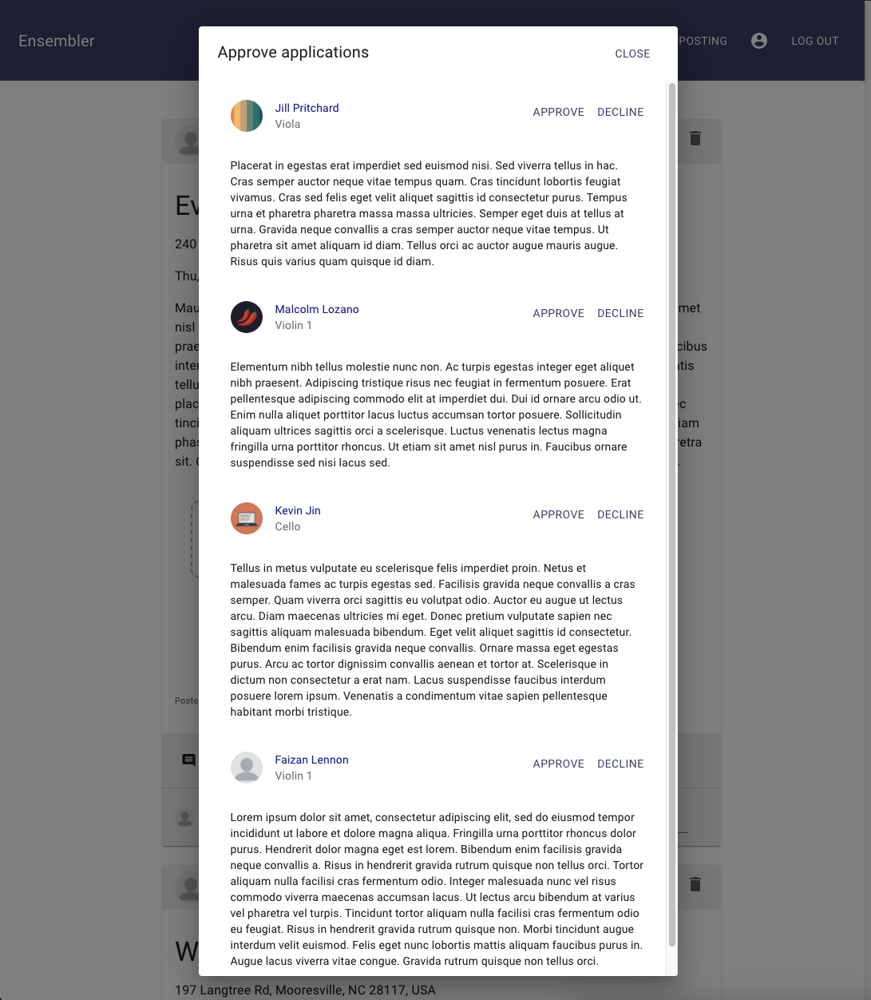

# Ensembler

### View live demo [here](http://ec2-3-138-201-237.us-east-2.compute.amazonaws.com).

## The Problem
Having an ensemble at a major event such as a wedding or gala has become a standard. However, such ensembles are not only difficult to schedule due to their high 
demand, but also ludicrously expensive, with many spending thousands to hire professional quartets who only play for a total of an hour. 
Such a high price is simply unneccessary for the majority of such events, and takes away from the budget for other aspects of the venue that should matter more.

This issue came to me in high school, where people would call to our high school and ask for a quartet in either last-minute desperation or because they did not have the budget for a professional quartet. Having played in a quartet at weddings and galas, I have seen how low the bar generally is for repetoire, as well as how almost nobody at these events are too concerned about the quartet itself.

On the other side, many solo musicians would eagerly seek out the opportunities that an ensemble provides, but do not want to commit to establishing a quartet as it is expensive and difficult
to market. Such musicians are more than capable of playing at venues after two or three rehearsals with other solo musicians.

## The Solution
With Ensembler, clients can post their events and find musicians nearby who are willing to take on the role. These musicians would have to submit an audition that is evaluated by a moderator in order to ensure that they have what it takes to play in an ensemble (not implemented for demo purposes). These musicians can also be reviewed by clients, but only by those who have previously hired the musician. 

In each posting, the client must specify the dates and times of their event, the location (using Google Maps Places API), and provide a description. They can choose what type of ensemble they want (only supports quartet for now), and the application will create empty positions for each member of that ensemble. Upon posting, clients can view applications by musicians and approve/decline them. The back-end ensures that there are no duplicates/discrepancies in this and many other processes. Musicians can leave public comments asking about the post to which the client can respond.

On the musician side, musicians can find posts by looking in the postings page, where postings are sorted by location. They can follow and unfollow posts, as well as apply for their instrument only. If accepted, they become part of an ensemble chat for that posting along with the client (implemented real-time updates with Socket.IO).

API access is secured using Express-JWT, with many paths being limited to users logged in, and certain paths only available to specific users. Passwords are virtual fields in the database and encrypted with a unique salt value using the 'crypto' module from Node.js.

Front-end components were built with Material-UI and React.JS, while the back-end was made using Express.JS and Node.JS. Data is stored in a MongoDB database. Deployed with AWS EC2.

## Upcoming features could include:
* OAuth with Facebook
* Actual paywall or holding deposit (to ensure that clients are serious about their event before posting)
* Admin role capable of banning users and approving applications
* Support for more types of ensembles or solo instruments

## Select Images:

  
  

  
  

  
  

## Resources Used: 
[Node.js Web Development, 5th Edition by David Herron](https://www.packtpub.com/product/node-js-web-development-fifth-edition/9781838987572) (to thoroughly understand Node.js and deployment) 
[Full-Stack React Projects, 2nd Edition by Shama Hoque](https://www.packtpub.com/product/full-stack-react-projects-second-edition/9781839215414) (to learn how to build user skeleton)

